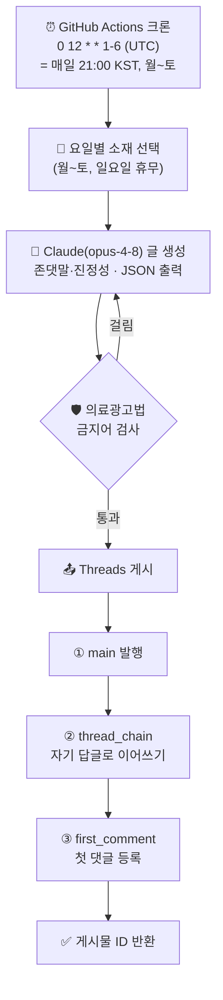

# 0ra_marketing 스레드 자동화 — 전체 워크플로우

> 병원마케팅·의료광고법 채널(`0ra_marketing`)에 **매일 21:00(KST, 월~토)** 스레드 글을 자동 생성·게시합니다.
> 오산디에스치과 자동화와는 **완전 별개** 프로젝트(다른 레포·다른 Meta 앱·다른 계정).

---

## 한눈에 보기



---

## 단계별 상세

### 1. 트리거 — `.github/workflows/threads-daily.yml`
- 크론 `0 12 * * 1-6` (UTC) = **21:00 KST, 월~토**. 일요일은 자동 종료.
- `workflow_dispatch`로 수동 실행 가능. 입력 `dry_run=true`면 **게시 없이 생성만** 검증.

### 2. 요일별 소재 선택 — `TOPICS` (threads_post.py)
| 월 | 화 | 수 | 목 | 금 | 토 |
|---|---|---|---|---|---|
| 의료광고법 실수 TOP5 | 블로그·플레이스 상위노출 | 대행사 고르는 법 | 사전심의 기준·사례집 | 환자가 안 오는 이유 | 마케팅 비유·인사이트 |

### 3. 글 생성 — Claude `claude-opus-4-8`
- 규칙: [`스레드_글쓰기_규칙.md`](스레드_글쓰기_규칙.md) — **존댓말 + 진정성**(후킹 지양), 5블록 구조, 가독성.
- 출력(JSON): `main` / `thread_chain[]` / `first_comment` / `hook_type` / `compliance_ok`.

### 4. 의료광고법 금지어 필터 — `BANNED_PATTERNS`
- `100%`, `완치`, `무조건`, `최고`, `유일`, `1등`, `부작용 없음`, `효과 보장` 등 감지 시 **재생성(최대 4회)**.
- JSON 파싱 실패 시에도 재생성.

### 5. 게시 — Threads Graph API
1. `main` 컨테이너 생성 → 30초 대기 → 발행
2. `thread_chain` 각 글을 **직전 글의 답글**(`reply_to_id`)로 연결 → 스레드 체인
3. `first_comment` 를 main의 답글로 등록
- 각 발행 사이 30초 대기(Threads 권장).

---

## 구성 파일

| 파일 | 역할 |
|---|---|
| `threads_post.py` | 전체 로직 (소재 선택·생성·필터·게시) |
| `.github/workflows/threads-daily.yml` | 크론 스케줄 + 수동 실행 |
| `스레드_글쓰기_규칙.md` | 글쓰기 규칙(존댓말·진정성·의료광고법·표절금지) |
| `스레드_자동화_가이드.md` | 초기 기획 가이드(참고용) |
| `requirements.txt` | `anthropic`, `requests` |

## GitHub Secrets (레포: scalemaker-ship-it/0ra-marketing-threads)

| 이름 | 설명 | 상태 |
|---|---|---|
| `ANTHROPIC_API_KEY` | Claude API 키 | ✅ 등록됨 |
| `THREADS_USER_ID` | Threads 사용자 ID (0ra_marketing) | ⏳ 발급 중 |
| `THREADS_ACCESS_TOKEN` | Threads 장기 액세스 토큰 (0ra_marketing) | ⏳ 발급 중 |

> Threads 장기 토큰은 약 60일마다 만료 → 주기적 갱신 필요.

## Meta 앱

- 전용 앱 **`오라마케팅_자동화`** (앱 ID: `2391674474662523`)
- 이용 사례: Threads API 액세스 / 권한: `threads_basic`, `threads_content_publish`
- 토큰: 설정 → **사용자 토큰 생성기** 에서 `0ra_marketing` 계정(Threads 테스터)으로 발급

---

## 로컬에서 테스트

```bash
# 게시 없이 글 생성만 확인
DRY_RUN=1 ANTHROPIC_API_KEY=... python threads_post.py

# 실제 게시(토큰 필요)
ANTHROPIC_API_KEY=... THREADS_USER_ID=... THREADS_ACCESS_TOKEN=... python threads_post.py
```
